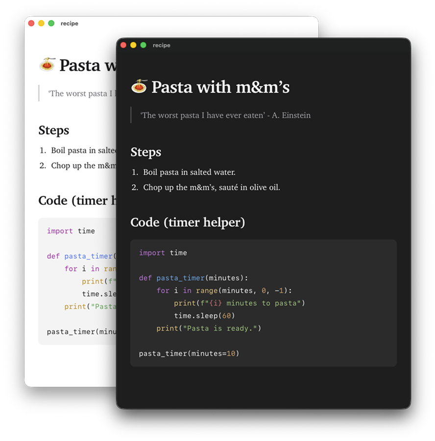

<h1 align="center">
  <br>
  glance
</h1>

<p align="center">
  A (markdown|code|csv) viewer that doesn't get in your way.  
</p>

<p align="center">
  
</p>

## Install

```sh
./build.sh
open glance.app
```

The script fetches highlight.js into `Sources/glance/Resources/`, builds with SwiftPM, assembles a `.app` bundle, and signs it with the entitlements in `glance.entitlements`. Requires Swift 5.9+ and macOS 13+.

Then install:

```sh
cp -R glance.app /Applications/
```

## CLI

```sh
open -a glance file.md         # open a file
glance --render file.md        # CLI: print rendered HTML to stdout
```

---

## Built on

- [swift-markdown](https://github.com/apple/swift-markdown) for parsing
- [highlight.js](https://highlightjs.org) for code

## License

MIT — see [LICENSE](LICENSE).
